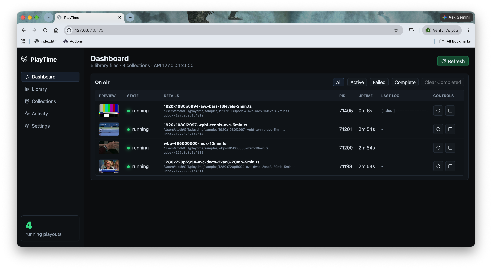

# PlayTime

PlayTime is a local MPEG-TS playout control application. It scans transport-stream libraries, saves playout collections as JSON, and supervises `tstools_bitrate_smoother` instances through a REST API and dark broadcast-style web UI.



## Quick Start

```sh
npm install
npm run dev
```

Open:

```text
http://127.0.0.1:5173
```

The REST API runs on:

```text
http://127.0.0.1:4500
```

Swagger/OpenAPI documentation is available at:

```text
http://127.0.0.1:5173/docs
```

Edit `data/settings.json` to point `libraryPaths` at your MPEG-TS library and adjust `smootherArgs` to match your `tstools_bitrate_smoother` command-line contract.

For the bundled `tstools_bitrate_smoother` binary, use the real playout template in `data/settings.real-smoother.example.json`:

```json
"smootherCommand": "./bin/tstools_bitrate_smoother",
"smootherArgs": ["-i", "{file}", "-o", "{target}", "-l", "500"]
```

## Metadata

PlayTime probes MPEG-TS files with the bundled static `ffprobe` by default:

```json
"metadataProbeCommand": "./bin/ffprobe",
"metadataProbeArgs": ["-v", "error", "-show_format", "-show_streams", "-show_programs", "-of", "json", "{file}"],
"mediaInfoCommand": "./bin/mediainfo"
```

Library rescans cache duration, bitrate, packet size, program/service data, codecs, video streams, audio streams, and probe errors in `data/cache/library-index.json`.

## Sidecar Metadata

Each transport stream can have an optional sidecar JSON file in the same directory. For `example.ts`, name the sidecar `example.playtime.json`:

```json
{
  "comment": "Important reference stream for QA."
}
```

The `comment` is shown in the Library view and included in library search results.
